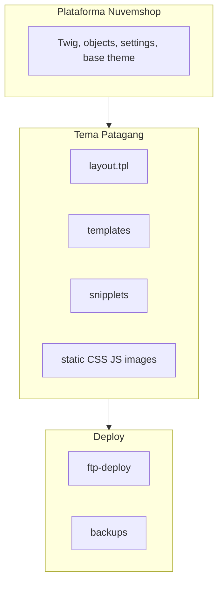

# Arquitetura – Projeto Patagang Nuvemshop

Documento único de arquitetura do **projeto Patagang** (tema Nuvemshop). Não confundir com `.agent/ARCHITECTURE.md`, que descreve o Antigravity Kit.

---

## Stack

- **Plataforma:** Nuvemshop (tema Twig)
- **Deploy:** FTP (ftps, credenciais em `ftp-deploy/config.js`)
- **Tema:** `theme-deploy-corrigido/` — origem do deploy
- **Scripts:** `ftp-deploy/` (deploy, backup), `scripts/` (git-sync)

---

## Diagrama de camadas

---

## Estrutura do tema

| Pasta | Conteúdo |
|-------|----------|
| `config/` | `settings.txt` (configurações do tema, cores, fontes), `sections.txt`, `translations.txt` |
| `layouts/` | `layout.tpl` — shell global; `` injeta o template da página |
| `templates/` | `home.tpl`, `product.tpl`, `category.tpl`, `search.tpl`, `cart.tpl`, etc. |
| `snipplets/` | Componentes por domínio: grid, header, footer, product, etc. |
| `static/` | `css/`, `js/`, `images/` |

---

## Fluxo de CSS

Ordem de carregamento no `layout.tpl`:

1. **Critical (inline):** `style-critical.tpl`, `style-menu-patagang.css.tpl`, `style-filters-patagang.css.tpl`
2. **Cores (inline):** `style-colors.scss.tpl` (compilado pela Nuvemshop)
3. **Async (link):** `style-async.scss.tpl` (`media="print"` → `onload="this.media='all'"`)
4. **Template-specific (link condicional):** ex. `style-home-v2.css` só se `template == 'home'`, `style-blog.scss.tpl`
5. **css_code:** `settings.css_code` (admin)
6. **Overrides finais (inline):** blocos `<style>` condicionais (ad bar, listagem, PDP) — carregam por último para vencer cascata/plataforma

Referências: [standards-css-e-tema-nuvemshop.md](../project/standards-css-e-tema-nuvemshop.md), [context-home.md](../project/context-home.md).

---

## Deploy e versão

- **Script:** `ftp-deploy/deploy-optimized.js`
- **Cache MD5:** `.deploy-cache.json`; envia apenas arquivos modificados
- **Backup incremental:** arquivos substituídos em `backups/incremental/[TIMESTAMP]/`
- **Backup full:** `node backup-full-ftp.js` → `backups/ftp-full/[TIMESTAMP]/`
- **Version ID:** injetado em `layout.tpl` a cada deploy; salvo em `LAST_DEPLOY_VERSION.txt`
- **Pós-deploy:** limpar cache do tema no admin Nuvemshop (Themes → tema ativo → Limpar Cache)

---

## Onde está o quê

| Documento / pasta | Conteúdo |
|-------------------|----------|
| [project/](../project/) | Contexto operacional, home, padrões CSS |
| [project/decisions.md](../project/decisions.md) | Decisões arquiteturais (ADR-lite) |
| [project/ai-onboarding.md](../project/ai-onboarding.md) | Onboarding para IA: onde ler primeiro |
| [features/](../features/) | Documentação por feature (README + referencia-atual) |
| [platform/](../platform/) | Referência Nuvemshop (Twig, objetos, base theme) |
