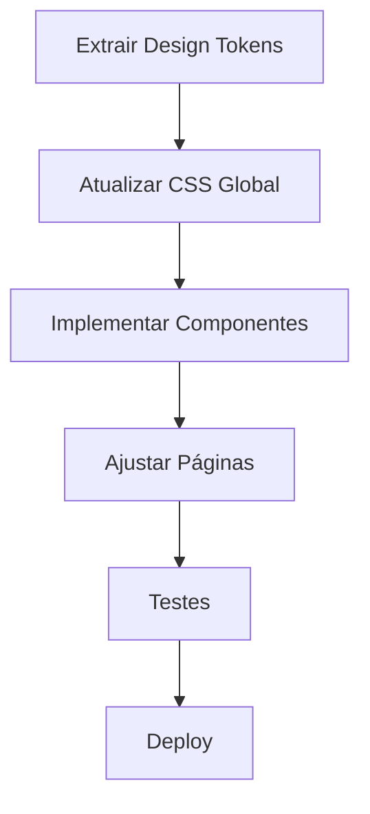

# ✅ Tarefas de Implementação - Patagang V2

> Backlog priorizado para implementação da V2

---

## 📊 Legenda de Prioridade

- 🔴 **P0 - Crítico:** Bloqueia o lançamento
- 🟠 **P1 - Alto:** Importante para a experiência
- 🟡 **P2 - Médio:** Melhoria significativa
- 🟢 **P3 - Baixo:** Nice to have

---

## 🎯 Sprint 1: Fundação

### Design Tokens
- [ ] 🔴 Extrair paleta de cores do Adobe XD
- [ ] 🔴 Mapear tipografia
- [ ] 🔴 Definir espaçamentos

### Preparação
- [ ] 🔴 Criar backup V1 (✅ Concluído)
- [ ] 🔴 Configurar ambiente de teste

---

## 🎯 Sprint 2: Core Visual

### CSS Global
- [ ] 🟠 Atualizar variáveis CSS
- [ ] 🟠 Implementar novas cores
- [ ] 🟠 Ajustar tipografia

### Componentes Base
- [ ] 🟠 Botões
- [ ] 🟠 Inputs
- [ ] 🟠 Cards

---

## 🎯 Sprint 3: Páginas

### Home Page
- [ ] 🟠 Hero/Banner
- [ ] 🟠 Grid de produtos
- [ ] 🟠 Header
- [ ] 🟡 Footer

### Outras Páginas
- [ ] 🟡 PDP ajustes
- [ ] 🟡 Categoria

---

## 🎯 Sprint 4: Polimento

- [ ] 🟢 Animações
- [ ] 🟢 Micro-interações
- [ ] 🟢 Performance

---

## 📝 Histórico de Conclusão

| Tarefa | Data | Responsável |
|--------|------|-------------|
| Criação da documentação V2 | $(date) | AI Agent |

---

## 🔄 Dependências

